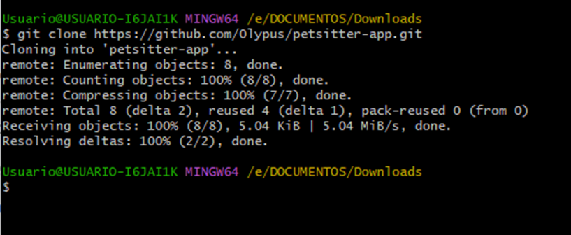
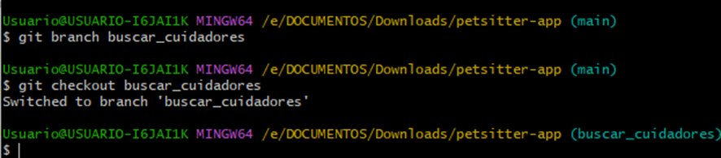
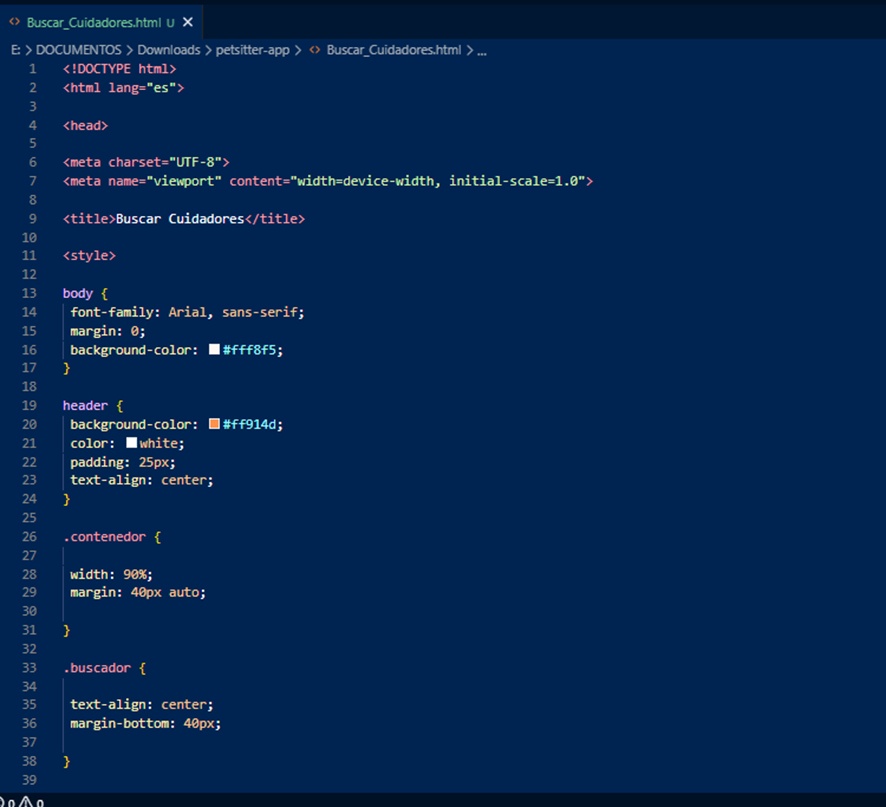
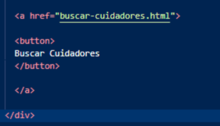
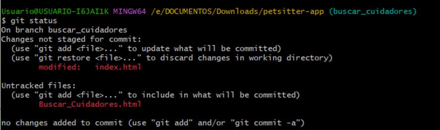
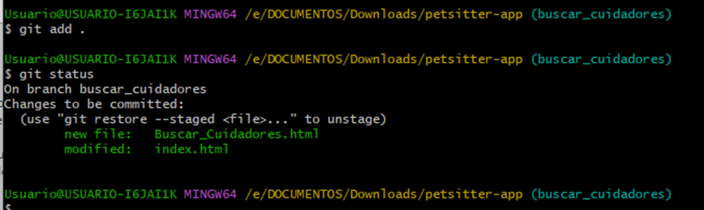
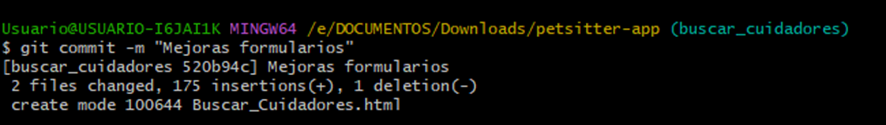
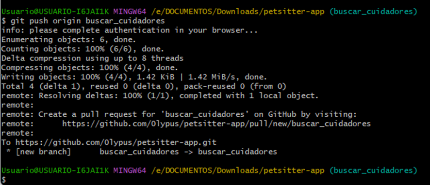

# PetSitter App 🐶🐱

## Descripción del proyecto
PetSitter es una aplicación pensada para conectar personas que necesitan cuidado para sus mascotas con cuidadores disponibles.

El proyecto busca resolver la dificultad de encontrar cuidadores confiables para mascotas cuando los dueños trabajan, viajan o no pueden atenderlas temporalmente.

### Usuarios principales
- Dueños de mascotas
- Cuidadores de mascotas
- Personas que buscan ofrecer servicios de cuidado

---

## Funcionalidades actuales

Actualmente el proyecto incluye:

 Landing principal  
 Registro de cuidadores  
 Inicio de sesión de cuidadores  

Archivos principales:

- index.html
- login-cuidadores.html
- registro-cuidadores.html

## Tecnologías utilizadas

Se utilizaron:

- HTML5
- CSS3
- Git
- GitHub
- Visual Studio Code

## Integrantes del grupo

| Integrante | Rol |
|------------|-----|
| Damian Palacios | integrante 1 |
| Agustin Coccia | integrante 2 |
| Sofia Rasi | integrante 3 |

## Organización del trabajo

### Branch utilizadas

  master
  - Rama inicial creada por Git.
  - Se realizaron los primeros commits y se subieron archivos del proyecto.

  main
  - Rama principal final del proyecto.
  - Se migró el contenido desde `master` y quedó como rama definitiva del repositorio.

  buscar_cuidadores
  - Rama creada para trabajar nuevas funcionalidades y modificaciones del proyecto.
  - Se realizaron cambios en archivos y actualización del README antes de hacer merge con `main`.

### Cambios realizados
 COMPLETAR

## Capturas de pantalla

- Branch buscar_cuidadores

      

[Agregar URL del repositorio]
